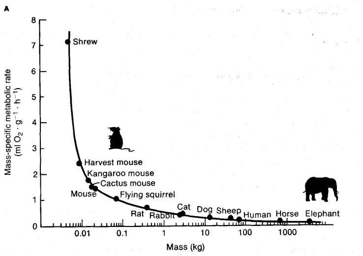

# Logaritmes en exponenten

<!-- Bij het vak *Chemie van het leven* leer je pH-berekeningen uit te voeren. Hierbij zul je in de logaritmische schaal werken. In deze portfolio-opdracht zullen we kennis maken met logaritmische berekeningen. Daarbij verken je meerdere contexten waarin de logaritme verschijnt. -->

<!-- Je werkt hierbij aan de onderstaande leerdoelen. Kruis deze voor jezelf af als je ze denkt te beheersen. -->

<!-- - [ ] Leerdoel X -->
<!-- - [ ] Leerdoel Y -->
<!-- - [ ] Leerdoel Z -->


In de vorige portfolio-opdracht ontdekte je dat het concept van entropie in allerlei schijnblijkelijk verschillende vakgebieden opduikt, waaronder  informatietheorie, thermodynamica, sociale wetenschappen en biodiversiteit. Hierbij zagen we steeds dezelfde wiskundige vorm, telkens anders geïnterpreteerd. Dat was geen toeval.

In deze opdracht bekijken we een tweede voorbeeld van zo'n terugkerende vorm: de logaritme. Je kent hem al van de pH-berekeningen die je hebt uitgevoerd bij het practicum van *Chemie van het leven*. Maar dezelfde functie duikt op als je kijkt naar hoe het metabolisme van een dier samenhangt met zijn lichaamsgewicht, hoe sterk een aardbeving is, of hoe hard een geluid klinkt. Aan het eind van deze opdracht kun je zelf uitleggen waarom dat zo is.


## Eigenchappen van de logaritme

De logartitme heeft een handige eigenschap voor het werken met concentraties en dus met de pH: hij comprimeert een enorm bereik (14 ordes van grootte in $[\text{H}^+]$) tot een overzichtelijke schaal. Diezelfde eigenschap zit achter de schaal van Richter (aardbevingen) en decibel (geluid): elke stap van 1 staat voor een factor 10 in de onderliggende grootheid.

Maar de logaritme heeft nog een tweede, andere eigenschap, die je eerder bij de rekenregels al hebt gezien: hij zet een *machtsverband* om in een *lineair* verband. Die eigenschap staat nu centraal, in een heel andere context dan pH: hoe lichaamsgrootte samenhangt met de rest van de biologie van een dier.

**Vraag 1:** Welke van deze eigenschappen van de logaritme verwacht je nodig te hebben om zo dadelijk het verband tussen massa en metabolisme van zoogdieren te analyseren? En op welke manier?

> jouw antwoord:


## Evo-devo: Allometrische schaling

We gaan nu kijken naar een andere context waarin logaritmes en exponenten helpen bij het begrijpen van biologische fenomenen. We duiken hierbij  weerhet vakgebied Evo-Devo in. 

Een interessant fenomeen binnen de evolutie is allometrische schaling. Dit beschrijft hoe biologische eigenschappen systematisch veranderen als de lichaamsgrootte toeneemt van soort tot soort. Wat opvalt, is dat veel kenmerken, zoals metabolismesnelheid, levensduur, loopsnelheid en breingrootte, niet linear toenemen, maar volgens een bepaalde machtswet. Deze disproportionele groei noemen we *allometrie*. We kunnen dit als volgt modelleren:

$$Y = aM^b.$$

Hierbij staat $Y$ voor de variabele die gemeten wordt (bv. metabolismesnelheid) en $M$ voor de massa. De coëfficiënt $a$ is soortspecifiek en $b$ is de allometrische exponent.

### De schijnbare paradox van de muis en de olifant

Een muis verbrandt, per gram lichaamsweefsel, veel sneller energie dan een olifant, en toch leeft de olifant vele malen langer. Beide dieren volgen hetzelfde hierboven beschreven allebei verband. Hoe kan dat?


Het antwoord hier zit op dezelfde manier in *welke* grootheid je bekijkt: massa-specifiek metabolisme (per gram) en totaal metabolisme (per dier) volgen beide een machtswet in $M$, maar met tegengestelde tendens. Dat ga je hieronder zelf aantonen.

::: aside
Vergelijk dit met de entropie-splitsing uit de vorige opdracht: $H(\text{fenotype}) = H(\text{soort}) + H(\text{fenotype}\mid\text{soort})$. Ook daar leek de combinatie van meer biodiversiteit én meer ordening (canalisatie) tegenstrijding, tot bleek dat het om twee aparte termen ging.
:::

### Voorbeeld en opdrachten: metabolismesnelheid

Om meer inzicht te krijgen in hoe deze machtsrelatie werkt, gaan we de volgende afbeelding analyseren:

\

We zien dat we een verband zoeken tussen de massa van een soort in kilogram en de metabolismesnelheid in mL zuurstofverbruik per gram per uur. Uit deze figuur kunnen we (ongeveer) de datapunten bepalen:

```{r}
massa = c(0.002, 0.008, 0.015, 0.02, 0.025, 0.08, 0.4, 
          2.5, 3, 14, 45, 72,700, 2500)  
metabolisme = c(7.15, 2.2, 1.85, 1.7, 1.65, 1.05, 0.75, 
                0.45, 0.4,0.2, 0.15, 0.1, 0.75, 0.05) 
```

**Vraag 2:** Plot hieronder de datapunten aan de hand van de vectoren die gegeven zijn. Waarom ziet het er anders uit dan de gegeven figuur?

```{r}
# gebruik de functie plot()
```

**Vraag 3:** Los het probleem op: hoe zou je ervoor kunnen zorgen dat de data goed leesbaar wordt? Wat voor verband kunnen we nu afleiden?

```{r}
# dit zou je zelf moeten doen 
# gebruik de functie log10()
plot(log10(massa), log10(metabolisme),      
     pch = 19, xlab = "log10(Massa)", 
     ylab = "log10(Metabolisme)")  
abline(lm(log10(metabolisme) ~ log10(massa)), col = "red")
```

**Vraag 4:** Leg nu in woorden uit waarom de gebruikte methode werkt, en relateer dat aan de machtsformule.

 > Jouw antwoord

We gaan nu iets beter kijken naar de betekenis van het aangetone verband. We hebben gekeken naar de massa-specifieke metabole snelheid, ook wel metabole intensiteit, die aangeeft hoe snel metabolisme verloopt per eenheid massa van een bepaald weefsel. Dit meten we bijvoorbeeld als de hoeveelheid $\text{O}_2$ die verbruikt wordt per uur. Aan deze eenheid zien we dat we dit kunnen berekenen door de totale metabole intensiteit te delen door de massa.

**Vraag 5:** Vul dit in bij de machtsformule, waarbij de gemeten variabele het totale metabolisme is. Maak gebruik van de rekenregels van de logaritme om een uitdrukking te krijgen voor de totale metabole intensiteit.

 > Jouw antwoord

Om terug te gaan naar het totale metabolisme in een dier, vermenigvuldigen we de massa en het massa-specifieke metabolisme.

```{r}
massa_metabolisme <- massa*metabolisme
```

**Vraag 6:** Probeer nu een relatie te vinden tussen de massa en het totale metabolisme. Plot deze relatie.

```{r}
# dit zou je zelf doen 
plot(log10(massa), 
     log10(massa_metabolisme)) 
abline(lm(log10(massa_metabolisme) ~ log10(massa)), col = "red")
```

**Vraag 7:** Wat kun je opmerken over het effect van een grotere massa op de totale metabole snelheid? En op de massa-specifieke metabole snelheid?

 > Jouw antwoord

**Vraag 8:** Gebruik de rekenregels van de logaritme en je eerdere antwoorden om een waarde voor de exponent $b$ te vinden. Hint: gebruik de functie \textrm{lm()} om een relevante waarde te vinden. Met \textrm{?lm()} vind je hoe je deze kunt gebruiken. 

 > Jouw antwoord
 
 
::: aside
Merk op dat je de functie \textrm{lm} al eerder hebt gebruikt, bij het practicum-deel van dit portfolio-onderdeel.Het zou dan vast een heel belangrijke functie zijn... Bij het volgende portfolio-onderdeel staan we hierbij stil!
:::
 
### Terug naar de paradox

**Vraag 8:** Je vond zojuist twee exponenten: één voor het verband tussen massa en massa-specifiek metabolisme, en één voor massa en totaal metabolisme. Laat met de rekenregels van de logaritme zien hoe deze twee exponenten met elkaar samenhangen. Verklaar daarmee je bevindingen.

> jouw antwoord:

## Slotopdracht 

In de vorige portfolio-opdracht schreef je een eigen hypothese over hoe entropie, onzekerheid en canalisatie zouden samenhangen met onderwerpen die je dit jaar nog zou tegenkomen.

**Vraag 9:** Lees je antwoord van toen terug.

- Klopte je speculatie?
- Zie je nu een verband tussen de logaritme hier en de entropie van vorige keer?
- In de introductie beschreven we dat de logaritme in zoveel uiteenlopende contexten (pH, aardbevingen, geluid, metabolisme) opduikt. Formuleer nu, in je eigen woorden, een algemene verklaring.

> jouw antwoord:

### Optioneel: Fractale structuren

De log-log-lineariteit die je hierboven gebruikte, komt niet toevallig ook terug bij fractale structuren. Dit zijn patronen die er op elke schaal ongeveer hetzelfde uitzien. 
Geïnteresseerden worden uitgenodigd om [hier](evo-devo/schaling.html) meer te lezen over fractale structuren.
